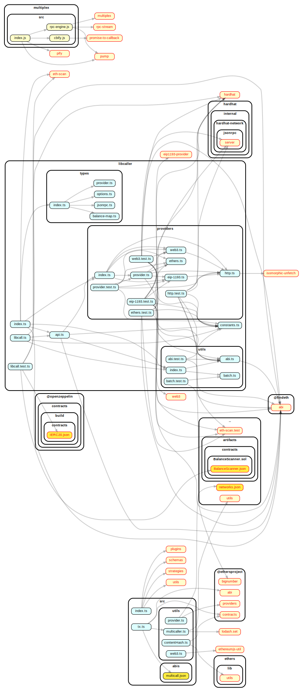

# `libcaller`

> monorepo for rpc/call data methods and tools

## [solidity-gencall](#)

> npm i -g solidity-gencall && solgen --version

## Overview

`solidity-gencall` is a shell utility for encoding multicall rpc calls on EVM
compatible chains

### Usage

> Quick start

```bash
solgen
```

`solgen` will recognize your function's and provide a menu for you, e.g.

```bash
? Select Function
WETH()
router()
permitAndCall(address,uint256,bytes4,bytes,bytes4,bytes)
```

#### Configuration File

```bash
.env
MNEMONIC=your-mneomic-phrase
RPC_ENDPOINT=your json rpc provider endpoint
```

## License

MIT

## Repo overview


